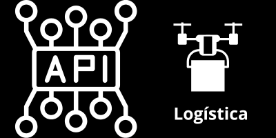
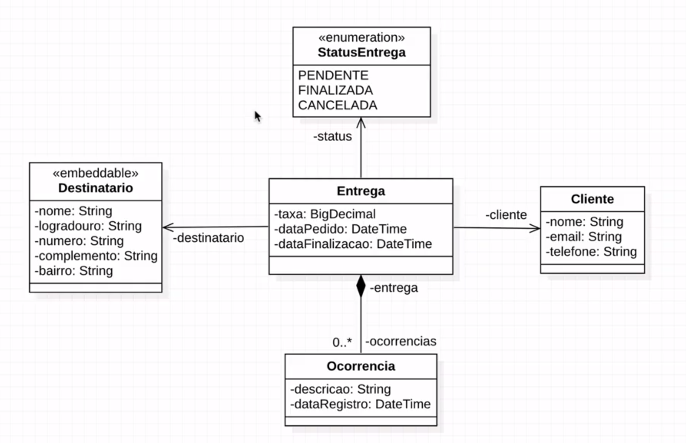
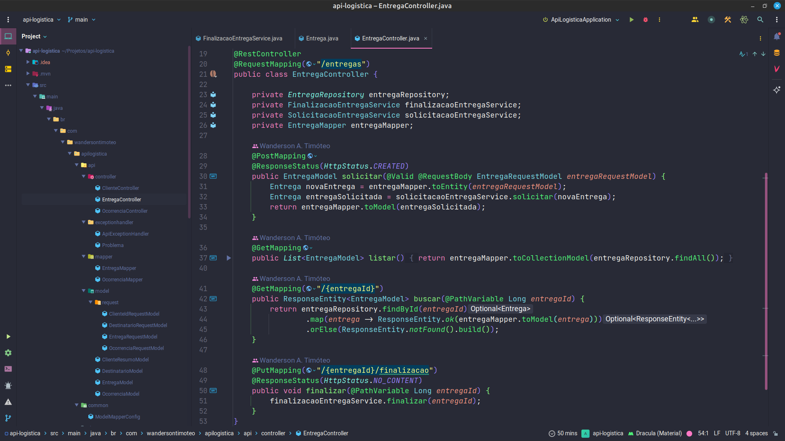

<h1 align="center">
    
</h1>

<p align="center">
  <a href="#-projeto">Projeto</a>&nbsp;&nbsp;&nbsp;|&nbsp;&nbsp;&nbsp;
  <a href="#-tecnologias">Tecnologias</a>&nbsp;&nbsp;&nbsp;|&nbsp;&nbsp;&nbsp;
  <a href="#-executar aplicação">Executar Aplicação</a>&nbsp;&nbsp;&nbsp;|&nbsp;&nbsp;&nbsp;
  <a href="#-licença">Licença</a>
</p>

<p align="center">
 

  
</p>

<br>

## 💻 Projeto

Neste projeto foi desenvolvido uma API para simular empresas que realizam entregas.
Esta API foi desenvolvida usando boas práticas de programação, separando suas responsabilidades.
Foi implementado services com regras de negócio, também foi utilizado o padrão ISO-8601 para data/hora na API, 
bem como a separação do Domain Model do Representation Model e convertido as Entidades usando o padrão 
DTO - Data Transfer Object, utilizando a biblioteca ModelMapper para criar classes de modelo de representação para 
transferência de dados. Além disso, foi implementado a persistência de dados com Jakarta Persistence para mapear 
as tabelas do banco de dados em classes Java, também foi utilizado a biblioteca Spring Data JPA para criar os 
repositórios que implementam os métodos que fazem as operações de persistência de dados e criado migrations usando 
Flyway para gerenciar os schemas do banco de dados. Inclusive foi implementado validação de dados com Bean 
Validation, tratamento de exceções de forma global e efetuado a modelagem de erros da API.

<br>

## 🎲 Modelagem Relacional

<p align="center">
    
</p>

Este é o Modelo Relacional em que a `api-logistica` foi desenvolvida.

<br>

## 🎲 Endpoints da API

<p align="center">
    
</p>

Na imagem temos os endpoints da API para realizar as requisições.

<br>

## 🚀 Tecnologias

Esse projeto foi desenvolvido com as seguintes tecnologias e ferramentas:

- [Java 17](https://www.java.com/pt-BR/)
- [Spring Boot 2.7.9](https://spring.io/projects/spring-boot)
- [MySQL 8.0](https://www.mysql.com/)
- [Flyway](https://flywaydb.org/documentation/database/mysql)
- [Model Mapper](https://modelmapper.org/)
- [Lombok](https://projectlombok.org/)
- [Jakarta Persistence JPA](https://jakarta.ee/specifications/persistence/3.0/)
- [Hibernate](https://hibernate.org/)
- [Spring Data JPA](https://docs.spring.io/spring-data/jpa/docs/current/reference/html/)
- [Bean Validation](https://beanvalidation.org/)
- [DBeaver](https://dbeaver.io/download/)
- [Postman](https://www.postman.com/)
- [Intellij IDE](https://www.jetbrains.com/pt-br/idea/)

<br>

## 👨‍💻 Executar Aplicação

### 🔥 Executando Localmente a Aplicação

Caso você deseja executar o projeto na sua máquina local, você precisará instalar o Java 17 e o banco de dados MySQL 8.0 em sua máquina. Após a instalação, basta seguir os passos abaixo:

### 🌀 Começando...

Para começar, você deve simplesmente clonar o repositório do projeto na sua máquina e instalar as dependências.

Abra o Explorador de Arquivos (caso esteja utilizando o Windows) navegue até o local onde você clonou o projeto, exemplo:

```sh
"C:\Users\NomeDoComputador\Documents\clonedoprojeto"
```

#### 💨 Executando a Aplicação


**Abra o projeto `api-logistica` com Intellij IDE ou sua IDE preferida e execute o spring boot app:** 

```sh
ApiLogisticaAplication.java
```
Este arquivo se localiza no diretório src/main/java/br/com/wandersontimoteo

Pronto! Desta forma o projeto estará rodando localmente em sua máquina, para acessar o backend:
<br>

```sh
http://localhost:8080
```
Com a aplicação rodando localmente você poderá testar os endpoints da API usando o Postman ou sua ferramenta de requisições preferida.
## 🚩 Tenho Dúvidas... O que fazer?

Caso tenham dúvidas sobre o código do projeto, sinta-se a vontade em abrir uma **[ISSUE AQUI](https://github.com/Wanderson-A-Timoteo/api-logistica/issues)**. Assim que possível, responderei todas as dúvidas que tiverem!
<br>

## Licença

Esse projeto está sob a licença MIT. Veja o arquivo [LICENSE](LICENSE.md) para mais detalhes.

## Autor:

Feito com ♥ by

[<br><sub>Wanderson A. Timóteo</sub>](https://wandersontimoteo.ga)

<br>

## Agradecimentos:

<h1 align="center">
    
</h1>
<h1 align="center">
    
</h1>

Projeto desenvolvido durante o evento `Mergulho Spring Rest` promovido pela [AlgaWorks](https://www.algaworks.com/).
Agradecimento ao [Thiago Faria de Andrade](https://www.linkedin.com/in/thiagofa/) por compartilhar conteúdo relevante e com qualidade de ensino.
